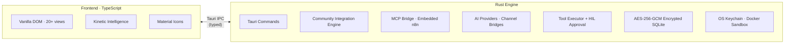

<div align="center">


<br>

**你的AI，你做主。**

本地桌面AI平台，能够完全离线运行，可以连接任何供应者，完全受你控制。

[](https://github.com/OpenPawz/openpawz/actions/workflows/ci.yml)
[](LICENSE)
[](https://discord.gg/wVvmgrMV)
[](https://x.com/openpawzai)
[](https://www.instagram.com/openpawz)

*默认私密，设计强大，原生可扩展。*

[English](README.md) · [简体中文](README.zh-CN.md)

</div>

---

## Paws 概述


**Pawz 实战**

https://github.com/user-attachments/assets/9bee2c08-ca86-4483-89a1-3eae847054b4

<br>

**记忆印痕** — 交互式知识图谱，采用力导向布局，边线粒子流动效果，支持记忆回溯

https://github.com/user-attachments/assets/60b0f351-180e-49ed-a70b-e31556743949

<br>

**集成中心** — 通过 MCP 桥接社区服务，支持分类筛选、连接状态监控与快速配置


<br>

**集群指挥** — 管理代理节点，部署模板，监控集群活动


<br>

**对话** — 会话指标, 活跃任务, 快捷操作与自动化


</div>

---

## 为什么选 OpenPawz?

OpenPawz 是一款基于 Tauri v2 的本地应用，采用纯 Rust 后端引擎。它可完全离线运行 Ollama，连接任何兼容 OpenAI 的提供商，让你完全掌控 AI 代理、数据和工具。

- **私密** — 不上云、不外传、不开端口。凭证使用 AES-256-GCM 加密存储在操作系统钥匙串中。
- **强大** — 多代理编排、11 种频道桥接、混合记忆、DeFi 交易、浏览器自动化、信息收集工作流。
- **可扩展** — 通过嵌入式 MCP 桥接 n8n 社区节点生态的通信集成，支持无限提供商、通过 PawzHub 获取社区技能、本地 Ollama 工作节点、模块化架构。
- **轻量** — ~5 MB 原生二进制文件. 不是 200 MB 的Electron（跨平台桌面应用框架） 封装。

---

## 集成反转

其他自动化平台都将集成锁定在工作流内部。必须先构建工作流，才能使用任何工具。OpenPawz 颠覆了这一模式——每个集成**同时**是直接代理工具和可视化工作流节点。

| | Zapier / Make / n8n (独立版) | OpenPawz |
|---|---|---|
| **工具可用性** | 锁定在工作流内部 | 在对话中直接使用，同时支持工作流 |
| **使用工具** | 先构建触发器 → 动作链 | 直接对代理发出指令 |
| **AI的角色** | 管道中的一个节点 | 管道内置于代理之中 |
| **安装新包** | 仅作为工作流节点 | 即时对话工具 + 工作流节点 |
| **社区节点** | 手动顺序自动化 | 通过 MCP 桥接实现 AI 编排 |

```
安装 "@n8n/n8n-nodes-slack":

  n8n 独立版:  作为工作流节点提供 → 必须构建工作流才能使用
  OpenPawz:        自动部署工作流 + 输入索引供代理发现
                   → "嘿 Pawz, 发送 hello 给 #general" — 搞定
```

**工作原理:** OpenPawz 将 n8n 嵌入为 MCP 服务器。n8n 的 MCP 暴露三个工作流级工具：search_workflows（搜索工作流）、execute_workflow（执行工作流）和 get_workflow_details（获取工作流详情）。当你安装社区包时，Paw 自动为每个服务部署一个工作流（例如"OpenPawz MCP — Slack"），封装集成逻辑。代理通过语义搜索发现工作流，并通过 execute_workflow 执行——全部通过 MCP 桥接完成。

**核心洞察:** n8n 的社区节点原本为手动自动化设计。OpenPawz 使其成为 AI 原生——Paw 自动部署工作流，将 n8n 节点与凭证绑定、错误处理和重试机制组合在一起。代理根据你的意图决定执行哪个工作流，只有当你需要带分支、循环或调度的多步骤编排时，才需要使用可视化 Flow Builder。

---

## 原创研究

OpenPawz 提出三种新型方法，用于扩展 AI 代理工具的使用规模与工作流执行。全部以 MIT 许可证开源。

### 图书管理员方法 — 基于意图陈述的工具发现

**问题:** AI 代理在工具过多时会出现故障。将数千个工作流定义加载到上下文中是不可能的，而基于关键词的预过滤器由于缺乏意图理解，往往会误判。

**解决方案:** 代理在理解用户意图后，主动请求工具。嵌入模型对工作流索引执行语义搜索，仅返回相关的工作流——按需、每轮实时检索。建议使用本地 Ollama 模型（如 nomic-embed-text）实现零成本，但任何嵌入模型均可使用。

```
用户："给 John 发邮件汇报季度情况"
  → 代理调用 request_tools("邮件发送功能")   ← 代理已理解意图
  → 图书管理员（嵌入模型）：嵌入查询 → 余弦相似度搜索 → email_send, email_read
  → 仅加载相关工具，而非所有可用定义
```

**核心洞察:** LLM 构建搜索查询（它已解析意图）。原始用户消息的预过滤器只能猜测——而代理知道。

📄 [完整案例研究: 图书管理员方法](reference/librarian-method.mdx)

### 工头协议 — 低成本工具执行

**问题:** 当云端 LLM 执行工具时，格式化与调用工具的推理过程消耗昂贵的 token。实际的 API 调用（Slack、Trello 等）免费或廉价——但 LLM 处理这些调用的成本却不低。

**解决方案:** 由更便宜的工人模型执行所有 MCP 工具调用，替代昂贵的架构师模型。关键因素是 **MCP's 的自描述模式** — MCP 服务器准确告知工人模型如何调用每个工具。无需预训练，无需配置。任何新的 n8n 社区节点都能立即执行。建议使用本地 Ollama 模型（如 qwen2.5-coder:7b）实现零成本，但任何提供商的任何模型均可使用。

```
架构师（云端 LLM）："发送 hello 到 #general" → 调用 mcp_slack_send_message
  → 引擎拦截 mcp_* 调用
  → 工头（工人模型）：通过 MCP 执行 → n8n → Slack API
  → 工具执行由堆栈中最便宜的有能力完成任务的模型处理
```

**核心洞察:** MCP 服务器是自描述的。工人模型无需知晓如何使用社区集成——MCP 在运行时会告知。

📄 [完整案例研究：工头协议](reference/foreman-protocol.mdx)

### 指挥协议 — AI 编译的流程执行

**问题:**  每个工作流平台——n8n、Zapier、Make、Airflow——都是按节点顺序遍历图：串行、同步，代理每执行一步就调用一次 LLM 。一个包含 6 个代理步骤的 10 节点 AI 管道需要 24 秒以上和 6 次 LLM 调用。循环（反馈回路、代理辩论）在结构上不可能——全部需要 DAG（有向无环图）。

**解决方案:** 指挥将流程图视为**意图的蓝图**，在单个节点运行前将其编译为优化的执行策略。五种优化策略——折叠（将 N 个代理合并为 1 次 LLM 调用）、提取（确定性节点完全绕过 LLM）、并行化（独立分支并发运行）、收敛（循环子图迭代直至输出稳定）、超立方（将图分区为带每单元内存隔离的并行单元，在事件视界同步）——将 10 节点流程从 24 秒/6 次调用减少到 4–8 秒/2–3 次调用。

```
10-节点流程，6个代理步骤：
  n8n / Zapier / Make：串行遍历 → 24 秒以上，6 次 LLM 调用
  OpenPawz 指挥：编译策略 → 4–8 秒，2–3 次 LLM 调用
收敛网格（代理辩论直至共识）：
  n8n / Zapier / Make：不可能——需要 DAG
  OpenPawz 指挥：双向边 → 迭代轮次 → 收敛
```

**核心洞察:** n8n 社区节点设计为手动顺序自动化。指挥使其成为 AI 可编排（用自然语言描述工作流），NLP 解析器构建图，指挥编译，代理执行。整个 n8n 生态成为 AI 原生自动化引擎。

📄 [完整案例研究：指挥协议](reference/conductor-protocol.mdx)

### 代理执行架构 — 5阶段优化管道

OpenPawz 实现**5阶段执行优化管道**，消除标准代理循环中的浪费。每个阶段均经过构建、测试（162 个专用测试），并接入实时代理循环。

| 阶段 | 名称 | 功能 | 效果 |
|-------|------|-------------|--------|
| **0** | 动作DAG规划 | 模型单次推理输出完整执行计划；引擎并行运行独立步骤 | 推理调用减少 3–5 倍 |
| **1** | 约束解码 | 提供商特定的强制模式（OpenAI strict、Anthropic tool_choice、Gemini tool_config、Ollama format: json） | 解析失败率为 0% |
| **2** | 嵌入索引工具注册表 | 持久化 SQLite 工具嵌入，四层搜索故障转移（向量 → BM25 → 领域 → 关键词） | 10 万级以上工具集定位 <100 毫秒 |
| **3** | 二进制 IPC | MessagePack 编码，通过 EventBatcher 和 ResultAccumulator 流式传输增量和计划结果 | 延迟降低 15–30% |
| **4** | 推测执行 | 代理的 CPU 分支预测——学习工具转换模式，预热连接，预测下一个工具 | 每次预测命中节省 200–800 毫秒 |

```
用户："设置每周短会，邀请团队，总结上周任务清单"

  阶段 2：确定工具（<100 毫秒）→ 加载日历、邮件工具
  阶段 0：单次推理 → DAG 计划：A(谷歌搜索) ‖ B(日历创建) → C(邮件发送)
  阶段 1：通过约束解码确保计划 JSON 有效
  阶段 3：通过二进制累加器组装 A 和 B 的结果
  阶段 4：A 运行时，预热邮件发送 API
  结果：2 次推理调用而非 6+ 次。任务在 4–12 秒内完成，而非 20–50 秒。
```

📄 [完整架构: 代理执行路线图.md](.AGENT_EXECUTION_ROADMAP.md)

---

## 质量

每次提交都经过 3 任务 CI 流水线验证：Rust（检查 + 测试 + clippy）、TypeScript（tsc + eslint + vitest + prettier）和安全（cargo audit + npm audit）。Rust 后端拥有 1,008 个库测试，其中包括 162 个专门针对 5 阶段代理执行架构的测试。详见 [企业级规划](ENTERPRISE_PLAN.md)了解完整加固审计。

---

## 安全

OpenPawz 采用纵深防御策略，拥有 10 层安全防护。代理从不直接接触操作系统——每个工具调用都流经 Rust 引擎，可被拦截、分类和阻断。

### 默认零信任

| 指标 | 数值 |
|--------|-------|
| 开放网络端口 | **0** — 仅 Tauri IPC，无 HTTP 服务器 |
| 凭证加密 | **AES-256-GCM** ，OS 钥匙串密钥存储 |
| 自动化测试 | **3,174** (1,008 Rust + 2,166 TypeScript) |
| CI 安全检查 | 每次推送执行 cargo audit + npm audit |
| 已知 CVEs | **0** CI强制执行 |
| Clippy 警告 | **0** 通过 via `-D warnings`强制执行 |

### 10层安全防护

1. **提示注入扫描器** — TypeScript + Rust 双检测，4 个严重等级 30+ 模式
2. **命令风险分类器** — 30+ 危险模式贯穿5 个风险等级（严重→安全），弹窗用颜色区分风险等级
3. **人工审核** — 有副作用的工具需显式用户批准；关键命令需输入"ALLOW"
4. **代理级工具策略** — 每个代理可设允许列表、禁止列表或无限制模式
5. **容器沙箱机制** — Docker 隔离，CAP_DROP ALL，内存/CPU 限制，默认禁用网络
6. **浏览器网络策略** — 域名允许/禁止列表防止数据外泄
7. **凭证保险箱** —  操作系统钥匙串 + AES-256-GCM 加密 SQLite；密钥永不出现在提示或日志中
8. **TLS 证书绑定** — 自定义 rustls 配置会固定到 Mozilla的根CA；排除操作系统信任库，防止被入侵的CA发起中间人攻击
9. **出站请求签名** — 每个提供商请求 SHA-256 签名（提供商‖模型‖时间戳‖正文），500 条审计环形缓冲区
10. **内存加密** — **Engram 记忆系统**对包含个人身份信息的记忆进行 AES-256-GCM 加密（使用独立的钥匙串密钥）。API 密钥采用 `Zeroizing<String>` 封装，释放时自动从内存清零。同时对所有检索出的记忆内容执行参数化查询净化和提示注入扫描。

### 为什么重要

- **无明文密钥** — 凭证静态加密，每个字段配备独立的初始化向量(IV)。如钥匙串不可用，应用完全阻止凭证存储而非回退到明文。
- **代理不会失控** — 自动拒绝或需显式批准。即使在"允许全部"会话覆盖模式下，权限提升仍被阻止。
- **90+ 安全命令模式** — 常用开发命令（git status、ls、cat、npm test）自动批准，不必每个无害操作都需点"允许"。
- **金融护栏** — 交易工具（兑换、转账）可配置每笔上限、每日亏损限额和交易对允许列表。只读交易（余额、价格）始终自动批准。
- **文件系统沙箱机制** — 20+ 敏感路径被阻止（~/.ssh、~/.aws、~/.gnupg、/etc、/root）。阻止路径遍历。可选只读模式禁用所有代理写入。
- **访问频道控制** — 每个频道桥接支持 DM 配对、用户允许列表和每代理路由。无开放中继。
- **完整审计追踪** — 每个安全事件记录风险等级、工具名称、决策和匹配模式。可筛选仪表板支持 JSON/CSV 导出。
- **技能审查** — 每个安全事件记录风险等级、工具名称、决策和匹配模式。可筛选仪表板支持 JSON/CSV 导出。

详见 [安全.md](SECURITY.md) 了解完整安全架构

---

## 功能特性

### 多代理系统
- 无限代理，自定义个性、模型和工具策略
- 老板/工人编排 — 代理委派任务并在运行时生成子代理
- 代理间通信 — 直接消息、广播频道和代理小队
- 代理小队 — 协作任务的团队组建与协调员角色
- 每个代理聊天会话，持久历史和迷你聊天弹窗
- 代理坞，带头像（50 个自定义 Pawz Boi 精灵）

### 社区集成 — 零间隙自动化

OpenPawz **内置 400+ 集成工具** 。但真正突破是**MCP 桥接** — 嵌入式 n8n 引擎通过模型上下文协议将你的代理连接到**社区集成**。无需安装插件，无需浏览市场。你的代理在运行时发现和安装集成工具，自动部署每个服务工作流，按需执行。

#### 工作原理

```
用户："为我的网站生成二维码"
  → 代理调用 request_tools("二维码生成")
  → 图书管理员（嵌入模型）找到 n8n-nodes-base.qrCode
  → 自动安装 n8n 社区包（如需要）
  → 通过 MCP 桥接执行
  → 返回二维码给用户
```

#### 内置（400+ 原生集成，无需额外安装）

| 类别 | 数量 | 示例 |
|----------|-------|----------|
| 生产力 | 40+ | Notion, Trello, Obsidian, Linear, Jira, Asana, Todoist, Google Workspace |
| 通信 | 30+ | Slack, Discord, Telegram, WhatsApp, Teams, Email (IMAP/SMTP) |
| 开发 | 50+ | GitHub, GitLab, Bitbucket, Docker, Kubernetes, Vercel, Netlify, AWS |
| 数据与分析 | 35+ | PostgreSQL, MongoDB, Redis, Elasticsearch, BigQuery, Snowflake |
| 媒体与内容 | 25+ | Spotify, YouTube, Whisper, ElevenLabs, Image Gen, DALL-E |
| 智能家居与物联网 | 20+ | Philips Hue, Sonos, Home Assistant, MQTT, Zigbee |
| 金融与交易 | 30+ | Coinbase, Solana DEX, Ethereum DEX, Stripe, PayPal, QuickBooks |
| 云与基础设施 | 40+ | AWS, GCP, Azure, Cloudflare, DigitalOcean, Terraform |
| 安全与监控 | 25+ | 1Password, Vault, Datadog, PagerDuty, Sentry, Grafana |
| AI与 ML | 20+ | Hugging Face, Replicate, Stability AI, Pinecone, Weaviate |
| CRM与营销 | 30+ | Salesforce, HubSpot, Mailchimp, SendGrid, Intercom |
| 其他 | 55+ | Weather, RSS, Web Scraping, PDF, OCR, QR codes, Maps |

#### MCP 桥接（通过嵌入式 n8n 的节点）

| 层 | 功能 |
|-------|-------------|
| **嵌入式 n8n** | 通过 Docker 或 npx 自动配置 — 启动时运行，零配置 |
| **MCP 传输** | 可流式 HTTP，位于 /mcp-server/http，JWT 认证 |
| **工作流级 MCP** | 三个工具: `search_workflows`, `execute_workflow`, `get_workflow_details` |
| **自动部署** | 安装社区包时自动创建服务工作流 |
| **工作流 RAG** | 嵌入模型通过语义搜索发现正确工作流（推荐本地 Ollama） |
| **本地工人** | Ollama qwen2.5-coder:7b 本地执行 MCP 工具调用 — 零成本 |

### 10个AI 提供商
| 提供商 | 模型 |
|----------|--------|
| Ollama | 任何本地模型（自动检测，完全离线） |
| OpenAI | GPT-4.1, GPT-4.1 mini, GPT-4.1 nano, o3, o4-mini |
| Anthropic | Claude Opus 4, Sonnet 4, Sonnet 4 Thinking, Haiku 3.5 |
| Google Gemini | Gemini 3.1 Pro, 3 Pro, 3 Flash (Preview), 2.5 Pro/Flash/Flash-Lite |
| OpenRouter | Meta-provider routing (100+ models) |
| DeepSeek | deepseek-chat, deepseek-reasoner |
| xAI (Grok) | grok-3, grok-3-mini |
| Mistral | mistral-large, codestral, pixtral-large |
| Moonshot/Kimi | moonshot-v1 models |
| 自定义 | 任何兼容 OpenAI 的端点 |

### 11种频道桥接
Telegram · Discord · IRC · Slack · Matrix · Mattermost · Nextcloud Talk · Nostr · Twitch · WebChat · WhatsApp

每个桥接包括用户审批流程、每个代理路由和统一的启动/停止/配置命令。相同的代理大脑、记忆和工具可以在所有平台工作。

### 记忆系统 — 印记计划
- **三层架构** — 感官缓冲区（当前轮次缓存）→ 工作记忆（优先级淘汰槽位）→ 长期图（情景/知识/程序存储）
- **混合搜索** — BM25 全文搜索 + 向量相似度，采用**倒数排名融合**（RRF）合并结果，并通过**传播激活**机制在记忆图的边上扩散关联记忆。
- **自动整合** — 后台引擎每 5 分钟运行模式聚类、矛盾检测、艾宾浩斯强度衰减和垃圾回收
- **18个记忆类别** — 在Rust 后端、代理工具和前端 UI中保持一致（通用、偏好、事实、项目、人员、技术、洞察、程序等）
- **感知加密** — 两层防御：17 个正则模式（邮箱、社会安全号、信用卡、JWT、AWS 密钥、私钥等），加上 LLM 辅助二次扫描上下文相关 PII。存储前字段级 AES-256-GCM 加密，独立钥匙串密钥与凭证保险箱分离
- **代理间记忆信任** — 记忆总线采用能力范围发布**、**发布端注入扫描和信任加权矛盾解决机制，防止跨代理记忆污染。
- **记忆生命周期** — 代理执行前自动召回相关记忆并注入上下文；任务、编排或压缩完成后自动捕获并存储结果。
- **频道范围记忆** — 来自 Discord、Slack、Telegram 等平台的记忆按频道和用户维度标记，确保独立检索
- **GDPR 第17条** — 擦除权，API 可安全清除指定用户标识符的全部记忆数据
- **上下文预算** — Token感知的 ContextBuilder 按优先级排序，使用模型特定的分词器将记忆打包进可用上下文窗口
- **记忆面板** — 可视化 UI 用于浏览和管理存储的记忆

### 内置工具与技能
- 社区集成（400+ 原生内置 + MCP 桥接扩展），自动注入加密凭证

- 来自于[skills.sh](https://skills.sh)生态和 PawzHub 市场的社区技能

- 三层可扩展性：技能（SKILL.md）→ 集成（pawz-skill.toml）→ 扩展（自定义视图 + 存储）

- 看板任务板，带代理分配、cron 调度和事件驱动触发器

- 代理间通信 — 直接消息和广播频道

- 代理小队 — 团队组建与协调员角色和小队广播

- 持久后台任务，带自动重新排队

- 研究工作流与发现和综合

- 完整邮件客户端（通过 Himalaya 的 IMAP/SMTP）

- 浏览器自动化，带托管配置文件

- ETH（7 条 EVM 链）+ Solana（Jupiter、PumpPortal）上的 DeFi 交易

- 仪表板小部件，带技能输出持久化

- 15 个斜杠命令，带自动完成

### Webhooks 与 MCP 桥接
- **嵌入式 n8n 引擎** — 启动时通过 Docker 或 npx 自动装配，零配置

- **MCP 桥接** — 可流式 HTTP 传输连接到 n8n 的 MCP 服务器，暴露工作流级工具（search_workflows、execute_workflow、get_workflow_details）

- **工作流自动部署** — 代理安装社区包后，Paw 自动部署对应的服务工作流，支持语义搜索

- **本地 MCP 工人** — Ollama qwen2.5-coder:7b 本地执行 MCP 工具调用，$0 成本

- 通用 webhook 服务器 — 接收外部事件并路由给代理

- MCP（模型上下文协议）客户端 — 连接到任何 MCP 服务器，可以获取额外工具

- 每个代理可独立配置专属的 MCP 服务器

- 事件驱动任务触发器 — 任务通过 webhooks 或代理间消息触发

- 完全自主代理运行的自动批准模式

### 语音
- Google TTS（Chirp 3 HD、Neural2、Journey）

- OpenAI TTS（9 种声音）

- ElevenLabs TTS（16 种优质声音）

- 对话模式 — 连续语音循环（麦克风 → STT → 代理 → TTS → 扬声器）

### Token 节省与成本控制

大多数 AI 工具让 token 消耗不受控制 — 通过上下文窗口，长对话悄悄耗尽你的资金。OpenPawz 会主动为你管理：

- **自动会话压缩** — 当对话接近上下文上限时，旧消息自动汇总为精简摘要，关键信息存入记忆，完整记录归档，对话无缝衔接。**长会话可节省 40–60% token**。

- **可配置上下文窗口** — 在设置中为每个代理设置上下文限制（4K–1M tokens）。保守默认值（32K）,防止大上下文模型的意外成本飙升。

- **实时 token 计量器** — 显示每个聊天会话中的实时上下文使用条。点击查看 token 去向的完整分解（系统提示、记忆、对话、工具）。使用到60% 和 80% 时会警告。

- **会话成本追踪** — 每会话成本显示在聊天头部和任务控制仪表板。输入/输出 token会分别追踪，同时会标注每个模型定价。

- **每日预算限制** — 设置每日消费上限。预算警报在 80% 触发，100% 强行停止。防止自动化任务、cron 作业或长代理循环的失控成本。

- **自动模型分层** — 启用 auto_tier 自动将简单查询路由到更便宜的模型。复杂任务使用你的主模型。基本问题 可削减成本 50%+ 且不损失质量。

- **智能技能提示预算** — 代理加载技能指令时，引擎压缩并优先排序以适配 token 预算。高优先级技能获得完整上下文；低优先级技能被压缩或丢弃。不浪费 token 在无关工具文档上。

- **精简频道上下文** — 频道桥接（Discord、Telegram 等）采用最小上下文策略：仅保留核心身份，免记忆召回开销，仅加载该频道必需的工具。响应快，省 token。

- **免费本地推理** — Ollama 模型零成本。日常测试、开发、轻量任务用本地模型，只有需要前沿能力时才切到付费提供商。

---

## 架构



无 Node.js 后端。无网关进程。无开放端口。一切通过 Tauri IPC 流动。

详见 [架构.md](ARCHITECTURE.md) 了解完整技术分解。

---

## 安装

### 前提条件

> **注意:** Node.js 仅用于构建前端 — 最终的应用是独立的约 5 MB 原生二进制文件 ，不依赖环境Node.js运行环境。

| 要求 | 版本 | 原因 | 安装 |
|-------------|---------|-----|---------|
| **Node.js** | 18+ | Vite 打包器 + TypeScript 编译器 (仅构建时) | [nodejs.org](https://nodejs.org/) |
| **Rust** | 最新稳定版 | 编译原生后端引擎 | [rustup.rs](https://rustup.rs/) |
| — | WebKit, SSL, 系统库 (见下文) | 根据平台 |

#### 可选 (运行时)

| 工具 | 用途 | 安装 |
|------|---------|---------|
| **Ollama** | 完全本地 AI — 无需 API 密钥 | [ollama.com](https://ollama.com/) |
| **Docker** | 代理命令的容器沙箱机制 | [docker.com](https://www.docker.com/) |
| **gnome-keyring** 或 **kwallet** | Linux 凭证加密的 OS 钥匙串 | 系统包管理器 |

### 平台特定依赖

<details>
<summary><strong>Linux (Debian / Ubuntu)</strong></summary>

```bash
# Tauri + WebKit所需的系统库
sudo apt update
sudo apt install -y \
  libwebkit2gtk-4.1-dev \
  build-essential \
  curl \
  wget \
  file \
  libxdo-dev \
  libssl-dev \
  libayatana-appindicator3-dev \
  librsvg2-dev


# GNOME 桌面通常已预装此组件
# 钥匙串（凭证加密必需）
# GNOME 桌面通常已安装
sudo apt install -y gnome-keyring libsecret-1-dev

# 安装 Rust
curl --proto '=https' --tlsv1.2 -sSf https://sh.rustup.rs | sh
source "$HOME/.cargo/env"

# 安装 Node.js 18+ (通过 nvm)
curl -o- https://raw.githubusercontent.com/nvm-sh/nvm/v0.40.1/install.sh | bash
nvm install 22
```

</details>

<details>
<summary><strong>Linux (Fedora)</strong></summary>

```bash
sudo dnf install -y \
  webkit2gtk4.1-devel \
  openssl-devel \
  curl \
  wget \
  file \
  libxdo-devel \
  libappindicator-gtk3-devel \
  librsvg2-devel \
  gnome-keyring \
  libsecret-devel

# 安装 Rust
curl --proto '=https' --tlsv1.2 -sSf https://sh.rustup.rs | sh
source "$HOME/.cargo/env"
```

</details>

<details>
<summary><strong>Linux (Arch)</strong></summary>

```bash
sudo pacman -S --needed \
  webkit2gtk-4.1 \
  base-devel \
  curl \
  wget \
  file \
  openssl \
  libxdo \
  libappindicator-gtk3 \
  librsvg \
  gnome-keyring \
  libsecret

# 安装 Rust
curl --proto '=https' --tlsv1.2 -sSf https://sh.rustup.rs | sh
source "$HOME/.cargo/env"
```

</details>

<details>
<summary><strong>macOS</strong></summary>

```bash
# 安装 Xcode 命令行工具 (提供 clang, make, 等.)
xcode-select --install

# 安装 Rust
curl --proto '=https' --tlsv1.2 -sSf https://sh.rustup.rs | sh
source "$HOME/.cargo/env"

# 安装 Node.js (通过 Homebrew)
brew install node
```

macOS 钥匙串自动使用 — 无需额外配置。

</details>

<details>
<summary><strong>Windows</strong></summary>

1. 安装 [Visual Studio Build Tools](https://visualstudio.microsoft.com/visual-cpp-build-tools/) 包含:
   - "使用c++的桌面开发"
   - Windows 10/11 SDK
2. 安装 [Rust](https://rustup.rs/) — 下载并运行 `rustup-init.exe`
3. 安装 [Node.js 18+](https://nodejs.org/) — 使用 LTS 安装程序

Windows 会自动使用凭据管理器存储凭证

</details>

<details>
<summary><strong>容器 / CI / server版Linux</strong></summary>


如果你在 Docker 容器、devcontainer 或服务器版linux中运行，默认没有图形钥匙串。你需要手动启动：

```bash
# 安装 gnome-keyring
sudo apt install -y gnome-keyring dbus-x11

# 启动钥匙串守护进程
eval $(dbus-launch --sh-syntax)
eval $(gnome-keyring-daemon --start --components=secrets 2>/dev/null)
export GNOME_KEYRING_CONTROL
```

没有运行的钥匙串，凭证加密将失败，集成也无法工作。应用的 **设置 → 安全** 面板显示会钥匙串健康状态。

</details>

---

### 快速开始

```bash
# 1. 克隆仓库
git clone https://github.com/OpenPawz/openpawz.git
cd paw

# 2. 安装前端依赖（包括用于 UI 动画的 anime.js）
pnpm install

# 3. 以开发模式运行（前端热重载 + Rust 实时重建）
pnpm tauri dev
```

> **首次构建需要 3–5 分钟**，Rust 编译所有依赖。后续构建为增量（约 5–15 秒）。
>
> **拉取更新后**，始终重新运行 `pnpm install` 以获取新依赖。

### 仅前端（无需 Rust / Tauri）

如果你只想运行前端 UI 而无需 Rust 后端（对 UI 开发或快速预览有用）：

```bash
pnpm install          # 每次 git pull 后都需要，以获取新依赖
pnpm dev
```

启动 Vite 服务器（地址 `http://localhost:1420/`），支持热重载。此模式下完整的 Tauri 后端（提供商调用、凭证保险箱、容器沙箱等）不可用，但所有视图和 UI 组件都会正常渲染。


### 验证是否正常工作

启动后，OpenPawz 会打开今日仪表板。按以下步骤验证各项功能是否正常：

1. **设置 → 安全** — 检查钥匙串健康状态显示为"健康"
2. **设置 → 提供商** — 配置至少一个 AI 提供商（或安装 Ollama 用于本地 AI）
3. **代理** —  创建代理并开始聊天

---

### 可选：Ollama（完全本地 AI）

对于完全离线的 AI，无需 API 密钥或云依赖:

```bash
# 安装 Ollama
curl -fsSL https://ollama.com/install.sh | sh

# 拉取对话模型
ollama pull llama3.1

# 拉取嵌入模型（用于记忆搜索）
ollama pull nomic-embed-text
```

OpenPawz 在 `localhost:11434` 自动检测 Ollama，并在 **设置 → 提供商** 中自动列出可用模型。

---

### 可选：Docker（容器沙箱隔离）

要启用命令的沙箱隔离执行：

```bash
# 安装 Docker (假如没有安装)
curl -fsSL https://get.docker.com | sh
sudo usermod -aG docker $USER
# 注销并重新登录以使组更改生效

# 验证 Docker 是否正常运行
docker run --rm hello-world
```

容器沙箱机制会在隔离的 Docker 容器中运行代理 shell 命令，带 `CAP_DROP ALL`、内存/CPU 限制，默认禁用网络。可以在 **设置 → 安全** 中配置。

---

### 配置集成

OpenPawz将所有凭证存储在由 OS 钥匙串支持的 AES-256-GCM 加密保险箱中。添加凭证有两种方式：

**选项 A：设置 → 技能**（推荐）

1. 打开 **设置 → 技能**
2. 找到集成（如 Slack、GitHub、n8n）
3. 输入凭证并点击 **保存**
4. 将技能切换为 **已启用**

**选项 B：集成面板**（如使用 n8n）

1. 打开 **集成** 视图
2. 点击服务并遵循设置指南
3. 输入凭证，点击 **测试并保存**
4. 应用测试连接，然后自动配置到技能保险箱

> **重要:** 凭证必须通过应用 UI 保存， 设置环境变量（`.env` 文件、shell 导出）无效。代理工具仅从 SQLite 中的加密技能保险箱读取，不从环境变量读取。

---

### 运行测试

```bash
# TypeScript 测试 (2,166个测试)
npx vitest run

# Rust 测试 (650个测试)
cd src-tauri && cargo test

# TypeScript 类型检查
npx tsc --noEmit

# Rust 检查（强制执行零警告）
cd src-tauri && cargo clippy -- -D warnings

# 代码格式检查
npx prettier --check "src/**/*.ts"
cd src-tauri && cargo fmt --check

# 一次运行所有
pnpm check
```

### 生产构建

```bash
pnpm tauri build
```

构建的应用将安装在 `src-tauri/target/release/bundle/` ，特定平台的安装程序如下:

| Platform | Output |
|----------|--------|
| macOS | `.dmg` + `.app` |
| Linux | `.deb` + `.AppImage` |
| Windows | `.msi` + `.exe` |

---

### 故障排除

| 问题 | 解决方法 |
|---------|-----|
| **Linux 首次构建失败** | 确保已安装所有系统库（见上面平台依赖章节） |
| **"钥匙串初始化失败"** | 没有钥匙串守护进程运行 —— 安装 `gnome-keyring` 并启动（见server版linux部分） |
| **"技能缺少必需凭证"** | 凭证必须通过应用 UI（**设置 → 技能**）保存，而非 `.env` 文件 |
| **配置未生效（无错误提示）** | 检查 **设置 → 安全** —— 如钥匙串为"不可用"，则保险箱无法加密凭证 |
| **未监测到Ollama** | 确保 Ollama 正在运行（执行命令`ollama serve`）且可访问 `http://localhost:11434` |
| **n8n "无API 访问权限"** | 在 n8n 实例环境中设置 `N8N_PUBLIC_API_ENABLED=true`，重启 n8n，并在 n8n **设置 → API** 中创建 API 密钥 |
| **Rust 编译内存不足** | 低内存机器（< 4 GB）上，关闭其他应用或添加交换空间: `sudo fallocate -l 4G /swapfile && sudo mkswap /swapfile && sudo swapon /swapfile` |
| **Docker 沙箱无法启动** | 确保 Docker 正在运行，且你的用户在 docker 组中（groups 检查） |

---

## 社区

加入交流、分享想法并关注开发：

| 频道 | 链接 |
|---------|------|
| Discord | [Join Server](https://discord.gg/wVvmgrMV) |
| X / Twitter | [@openpawzai](https://x.com/openpawzai) |
| Instagram | [@openpawz](https://www.instagram.com/openpawz) |
| Matrix | [#openpawz:matrix.org](https://matrix.to/#/#openpawz:matrix.org) |
| GitHub 讨论 | [OpenPawz/openpawz Discussions](https://github.com/OpenPawz/openpawz/discussions) |
| Bluesky | [@openpawz.bsky.social](https://bsky.app/profile/openpawz.bsky.social) |
| Mastodon | [@openpawz@fosstodon.org](https://fosstodon.org/@openpawz) |

## 路线图

进度通过 [里程碑](https://github.com/OpenPawz/openpawz/milestones) 和 [GitHub 项目](https://github.com/orgs/OpenPawz/projects) 追踪：

- [**v0.2 — 打包与分发**](https://github.com/OpenPawz/openpawz/milestone/1) — 稳定二进制文件、Homebrew/AUR/Snap/Flatpak、Windows 与 macOS CI
- [**v0.3 — 插件 API 与 PawzHub**](https://github.com/OpenPawz/openpawz/milestone/2) — 社区扩展 API、PawzHub 市场、国际化
- [**v0.4 — 移动端与同步**](https://github.com/OpenPawz/openpawz/milestone/3) — 移动伴侣（iOS/Android）、加密云同步
- [**v1.0 — 生产就绪**](https://github.com/OpenPawz/openpawz/milestone/4) — 企业加固、稳定 API、第三方安全审计

详见 [企业级规划.md](ENTERPRISE_PLAN.md) 了解加固审计。

---

## 贡献

OpenPawz 由一名开发者构建，需要你的帮助。每份贡献都很重要 —— 包括代码、文档、测试、翻译、打包。

**从这开始:**

- [`good first issue`](https://github.com/OpenPawz/openpawz/labels/good%20first%20issue) — 适合新人的范围任务
- [`help wanted`](https://github.com/OpenPawz/openpawz/labels/help%20wanted) — 需要帮助的更大任务
- [贡献.md](CONTRIBUTING.md) — 完整设置指南、代码风格和"从何开始"选择器

**认领issue** 通过评论"我想做这个" —— 你将在 24 小时内被分配任务。如果有问题？在 [Discord](https://discord.gg/wVvmgrMV) 或 [讨论](https://github.com/OpenPawz/openpawz/discussions) 中提问。

### 贡献者

<a href="https://github.com/OpenPawz/openpawz/graphs/contributors">
  
</a>

---

## 文档

| 文件 | 描述 |
|----------|-------------|
| [架构.md](ARCHITECTURE.md) | 完整技术分解 —— 目录结构、模块设计、数据流 |
| [安全.md](SECURITY.md) | 完整安全架构 —— 7 层、威胁模型、凭证处理 |
| [贡献.md](CONTRIBUTING.md) | 开发设置、代码风格、测试、PR 指南 |
| [企业级规划.md](ENTERPRISE_PLAN.md) | 企业加固审计 —— 所有阶段及测试数 |
| [印记.md](ENGRAM.md) | 记忆系统白皮书 —— 三层架构、安全模型、形式化证明 |
| [代理执行路线图.md](.AGENT_EXECUTION_ROADMAP.md) | 5 阶段代理执行优化管道 —— 动作 DAG、约束解码、工具注册表、二进制 IPC、推测执行 |
| [更新日志.md](CHANGELOG.md) | 版本变更记录和发布说明 |
| [官方文档网站](https://www.openpawz.ai) | 带指南、频道设置和 API 参考的完整文档 |

---

## 技术栈

| 层 | 技术 |
|-------|-----------|
| 框架 | [Tauri v2](https://v2.tauri.app/) |
| 后端 | Rust (async, Tokio) |
| 前端 | TypeScript (vanilla DOM) |
| 数据库 | SQLite (21 tables, AES-256-GCM encrypted fields) |
| 打包工具 | Vite |
| 测试 | vitest (TS) + cargo test (Rust) |
| CI | GitHub Actions (3 个并行任务) |

---

## 免责声明

OpenPawz 是根据 MIT 许可证"依现状"提供的开源软件，无任何担保。

**使用本软件即表示你承认并同意：**

- 作者和贡献者对因使用本软件造成的任何损害、数据丢失、财务损失、安全事件或其他后果**不承担责任**。
- 你全权负责如何使用本软件，包括 AI 代理执行的任何操作、自动化任务、交易操作或你配置的集成工具。
- AI 生成的输出可能不准确、不完整或不恰当。在采信前，请务必审查代理的操作和输出。
- 交易和金融功能是实验性的。**永远不要冒险你无法承受损失的资金。**开发者不是财务顾问。
- 你有责任遵守你所在司法管辖区的适用法律、法规和第三方服务条款。
- 本软件可能会与第三方 API 和服务交互。开发者不对这些服务的可用性、准确性或条款负责。

这是一个社区驱动的开源项目。使用风险自负。

---

## 许可

MIT — 见 [LICENSE](LICENSE)

